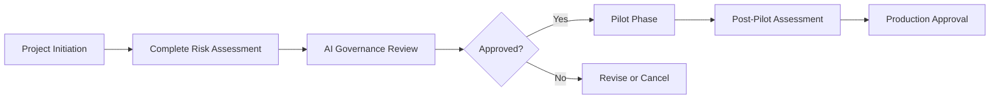

# Forms - Templates and Assessments

This directory contains form templates for AI governance processes.

## Purpose

Standardized assessment templates required for AI project approvals, risk evaluations, and governance compliance.

## 📋 Contents

| Form | Purpose | Format | Required For |
|------|---------|--------|--------------|
| AI Risk Assessment Form | Risk evaluation for AI systems and projects | JSON | All AI projects before pilot phase |

## 🔍 AI Risk Assessment Form

Template for evaluating AI systems across multiple dimensions:

### Sections

1. **System Details**
   - AI system name, requestors, business units
   - System description and use case
   - Pilot test criteria
   - Terms and conditions links

2. **Data Management**
   - Data sets used in training/operation
   - Storage locations (underlying and Teledyne)
   - System integrations and data flows
   - AI models employed

3. **User Validation**
   - External output usage
   - Product/service integration
   - Employment-related usage
   - Human review processes
   - AI content marking procedures
   - Feedback mechanisms

4. **Potential Risks**
   - **Bias & Fairness**: Data completeness and representation
   - **Third-Party IP**: Intellectual property concerns
   - **Data Privacy & Confidentiality**: Unauthorized access risks
   - **Cybersecurity**: Security vulnerabilities (reviewed by ITSS)
   - **Accuracy, Reliability & Safety**: Output quality concerns

5. **Assessment Results**
   - Efficiency/productivity improvements
   - Risks identified and mitigated
   - Approval decision

6. **Implementation Conditions**
   - Standard instructions for deployment
   - Recordkeeping requirements

## 📝 Form Workflow

## 🔐 Risk Assessment Criteria

### Risk Levels
- **Low**: Well-understood technology, clear mitigation path
- **Medium**: Some uncertainty, additional review needed
- **High**: Novel technology, sensitive data, or complex implementation

### Required Reviews
- IT Security (for all systems)
- Legal/Compliance (for customer-facing or HR systems)
- Business Unit leadership (for segment-specific deployments)
- AI Governance Committee (for enterprise initiatives)

## ✅ Completion Guidelines

1. **Be Specific**: Provide concrete examples and metrics
2. **Include Evidence**: Reference documentation, vendor materials, security assessments
3. **Address All Risks**: Even if mitigation is "not applicable," explain why
4. **Update Post-Pilot**: Revise assessment with pilot results before production

## 🔄 Template Updates

When updating form templates:
1. Maintain JSON structure for programmatic processing
2. Add new fields to the appropriate section
3. Update this README with field descriptions
4. Version the template file appropriately

## Navigation

- [← Back to Root](../README.md)
- [Flowcharts](../Flowcharts/README.md) - Process diagrams
- [Lists](../Lists/README.md) - JSON data files
- [.github](../.github/README.md) - Agent instructions
- [Flowcharts](../Flowcharts/README.md) - Process diagrams
- [Lists](../Lists/README.md) - JSON data files
- [.github](../.github/README.md) - Agent instructions

---

*For questions about risk assessments, contact AI Governance Committee.*
